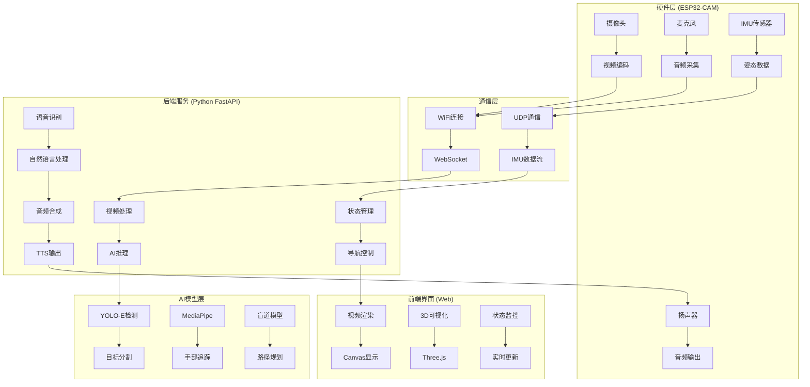
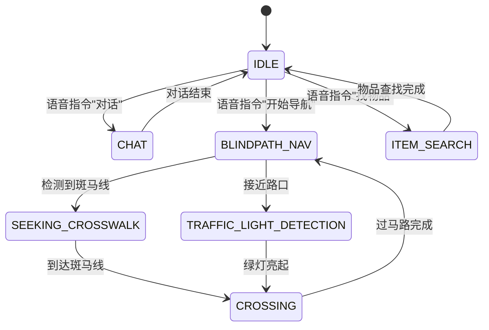

# 🏗️ 技术架构总览

## 📋 系统概述

**OpenAI Glasses for Navigation** 是一个基于ESP32智能眼镜的AI导航辅助系统，专为视觉障碍用户设计。系统采用**边缘计算 + 云计算混合架构**，结合深度学习、计算机视觉和语音识别技术，提供实时导航引导服务。

## 🎯 设计目标

### 核心功能
- **盲道导航**: 基于视觉的盲道识别与路径规划
- **过马路辅助**: 斑马线检测与安全引导
- **物品查找**: 开放词汇目标检测与手部引导
- **语音交互**: 实时语音识别与TTS反馈
- **环境感知**: IMU姿态感知与3D可视化

### 技术指标
- **实时性**: 视频处理延迟 < 100ms
- **准确性**: 盲道检测准确率 > 95%
- **稳定性**: 7×24小时连续运行
- **便携性**: 轻量化硬件设计

## 🏛️ 整体架构



## 🔧 技术栈详解

### 硬件技术栈
| 组件 | 技术选型 | 规格参数 |
|------|----------|----------|
| **主控芯片** | XIAO ESP32S3 | 双核Xtensa LX7, 240MHz |
| **摄像头** | OV5640 | 5MP, VGA@30fps, JPEG压缩 |
| **麦克风** | PDM数字麦克风 | 16kHz采样, 单声道 |
| **IMU传感器** | ICM42688 | 6轴陀螺仪+加速度计, SPI接口 |
| **音频输出** | I2S数字音频 | 16bit/44.1kHz, 立体声 |
| **通信** | WiFi 802.11n | 2.4GHz, 150Mbps |

### 软件技术栈

#### 后端服务 (Python)
```python
# 核心框架
FastAPI + Uvicorn          # Web框架
asyncio + WebSocket        # 异步通信
OpenCV + NumPy            # 计算机视觉
PyTorch + Ultralytics     # 深度学习
MediaPipe                 # 手部检测
DashScope SDK             # 阿里云AI服务
```

#### 前端界面 (Web)
```javascript
// 核心技术
HTML5 Canvas              // 视频渲染
WebSocket API             // 实时通信
Three.js                  // 3D可视化
CSS3 + 毛玻璃效果         // 现代UI设计
```

#### 嵌入式固件 (Arduino C++)
```cpp
// ESP32开发框架
Arduino Core              // 开发框架
WiFi + WebSocket          // 网络通信
esp_camera.h              // 摄像头驱动
ESP_I2S.h                 // 音频处理
SPI + ICM42688            // IMU通信
```

## 🔄 数据流架构

### 视频流处理管道
```
ESP32-CAM (JPEG) 
    ↓ WebSocket /ws/camera
bridge_io.push_raw_jpeg()
    ↓ 原始帧缓冲
navigation_master.process_frame()
    ↓ AI推理处理
bridge_io.send_vis_bgr()
    ↓ 处理后帧
WebSocket /ws/viewer
    ↓ 前端渲染
Browser Canvas
```

### 音频流处理管道
```
ESP32-MIC (PCM16)
    ↓ WebSocket /ws_audio
asr_core.ASRCallback()
    ↓ 语音识别
DashScope ASR API
    ↓ 识别结果
navigation_master.on_voice_command()
    ↓ 指令处理
Qwen-Omni / TTS
    ↓ 语音合成
audio_player.play_voice_text()
    ↓ 音频输出
ESP32-Speaker
```

### IMU数据流管道
```
ESP32-IMU (ICM42688)
    ↓ SPI通信
UDP Port 12345
    ↓ 网络传输
process_imu_and_maybe_store()
    ↓ 数据处理
WebSocket /ws
    ↓ 前端传输
visualizer.js (Three.js)
    ↓ 3D渲染
Browser 3D Scene
```

## 🧠 AI算法架构

### 深度学习模型集成
```python
# 模型加载与初始化
class ModelManager:
    def __init__(self):
        self.yolo_e = YoloEBackend("yoloe-11l-seg.pt")
        self.hand_landmarker = mp.solutions.hands.Hands()
        self.blind_path_model = YOLO("yolo-seg.pt")
        self.traffic_light_model = YOLO("trafficlight.pt")
```

### 核心算法模块

#### 1. 盲道导航算法
```python
class BlindPathNavigator:
    def process_frame(self, frame):
        # 盲道分割
        masks = self.segment_blind_path(frame)
        # 障碍物检测
        obstacles = self.detect_obstacles(frame)
        # 路径规划
        guidance = self.plan_path(masks, obstacles)
        return guidance
```

#### 2. 过马路导航算法
```python
class CrossStreetNavigator:
    def process_frame(self, frame):
        # 斑马线检测
        crosswalk = self.detect_crosswalk(frame)
        # 方向对齐
        alignment = self.compute_alignment(crosswalk)
        # 安全引导
        guidance = self.generate_guidance(alignment)
        return guidance
```

#### 3. 物品查找算法
```python
class ItemSearchNavigator:
    def process_frame(self, frame):
        # 目标检测
        targets = self.detect_targets(frame)
        # 手部追踪
        hands = self.track_hands(frame)
        # 引导生成
        guidance = self.generate_hand_guidance(targets, hands)
        return guidance
```

## 🎛️ 状态机设计

### 系统状态定义
```python
# 核心状态枚举
IDLE = "IDLE"                          # 空闲状态
CHAT = "CHAT"                          # 对话模式
BLINDPATH_NAV = "BLINDPATH_NAV"        # 盲道导航
SEEKING_CROSSWALK = "SEEKING_CROSSWALK"# 寻找斑马线
CROSSING = "CROSSING"                  # 过马路
ITEM_SEARCH = "ITEM_SEARCH"            # 物品查找
TRAFFIC_LIGHT_DETECTION = "TRAFFIC_LIGHT_DETECTION"  # 红绿灯检测
```

### 状态转换逻辑


## 🔒 安全架构

### 数据安全
- **加密传输**: WebSocket over WSS
- **数据脱敏**: 敏感信息本地处理
- **隐私保护**: 视频数据不存储

### 系统安全
- **输入验证**: 严格的参数校验
- **异常处理**: 完善的错误恢复机制
- **资源管理**: 内存和CPU使用监控

## 📈 性能优化

### 实时性优化
- **帧率控制**: 动态FPS调整
- **模型优化**: 量化与剪枝
- **并行处理**: 多线程异步处理

### 资源优化
- **内存管理**: 帧缓冲池
- **CPU优化**: SIMD指令集
- **网络优化**: 数据压缩与批处理

## 🚀 扩展性设计

### 模块化架构
- **插件系统**: 可插拔功能模块
- **API标准化**: 统一的接口规范
- **配置驱动**: 动态配置管理

### 水平扩展
- **微服务化**: 服务拆分与解耦
- **负载均衡**: 多实例部署
- **容器化**: Docker容器部署

---

**下一步**: 查看 [硬件设计文档](../hardware/README.md) 了解ESP32智能眼镜的详细设计。
